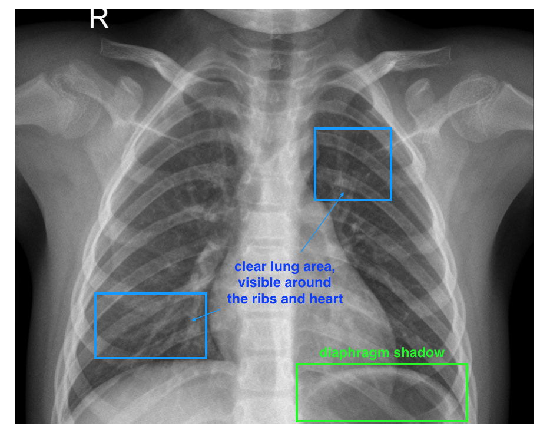
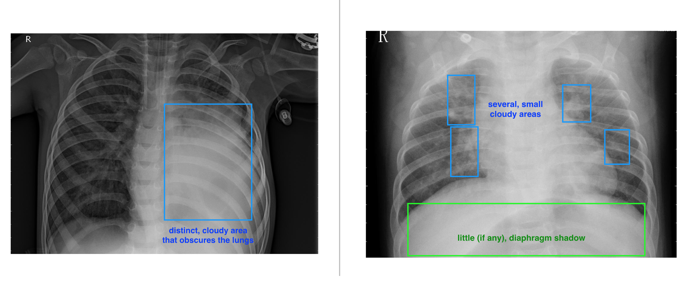

#  Project: Create a Medical Image Annotation Job

## Table of Contents 

- [Overview](#overview) 
- [The Data](#data)
- [References](#references)

## Overview  <a name="overview"/>

In this project, I will design my own data labeling job using [Appen's](https://appen.com/) platform for a given dataset and business goal. 

My goal is to build a labeled dataset that distinguishes between healthy and pneumonia x-ray images.

This can be used by ML engineers later on down the line to build a classification product that:

- Can help flag serious cases
- Quickly identify healthy cases
- And, generally, act as a diagnostic aid for doctors

The main task will be to create a data labeling job using [Appen's](https://appen.com/) platform.

## The Data  <a name="data"/>
The dataset is a modified version of this [Kaggle chest x-ray dataset](https://www.kaggle.com/paultimothymooney/chest-xray-pneumonia), with most labels removed. Every piece of data is a chest x-ray image. You may see images taken that are slightly different in size and taken under slightly different exposure times. A typical, labeled image is shown below:

A labeled, healthy, chest x-ray image. Pay close attention to the two lungs and diaphragm (below the lungs).

## How to distinguish Pneumonia symptoms in a chest x-ray image?

This is a challenging task because it is not always clear when pneumonia symptoms are present or not in an image. As such, the system is not meant to be a replacement for a doctor, only to aid in quickly identifying healthy patients and surfacing potential cases of pneumonia.

We should design a data annotation job, such that a non-expert can identify more noticeable cases of pneumonia. Since we are designing for a non-expert annotator, we should design for failure; this means including some way to capture uncertainty in our data labels and test questions.

So, what indicates pneumonia and what kind of advice and examples can we give potential annotators?

There are a few different visual symptoms that indicate pneumonia. The most important areas to have annotators pay attention to are the lungs and the diaphragm.

A normal, healthy image will depict clear lungs without any areas of abnormal cloudiness/opacity; there may be structured, web-like vasculature in the lungs but otherwise that area should be clear. In healthy images, we are also more likely to see a diaphragm shadow.

A pneumonia image may include a few things: areas of cloudiness/opacity in several concentrated areas or one large area. We may also see a general pattern of opacity that obscures the structure of the lungs, heart and diaphragm.

Some characteristics of a healthy image: a clear lung area.

Examples of pneumonia symptoms: (Left) a concentrated, opaque area in the lungs, (Right) multiple, smaller opaque areas throughout the lung area and any diaphragm shadow is obscured.

## References <a name="references"/>

- [AI Product Manager Program - Udacity](https://www.udacity.com/course/ai-product-manager-nanodegree--nd088)
- [Appen](https://appen.com/)
- [Kaggle](https://www.kaggle.com)
- [Chest x-ray dataset](https://www.kaggle.com/paultimothymooney/chest-xray-pneumonia)

